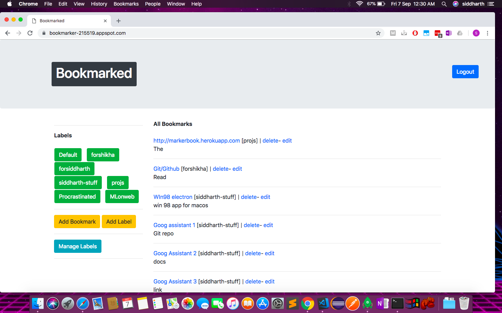
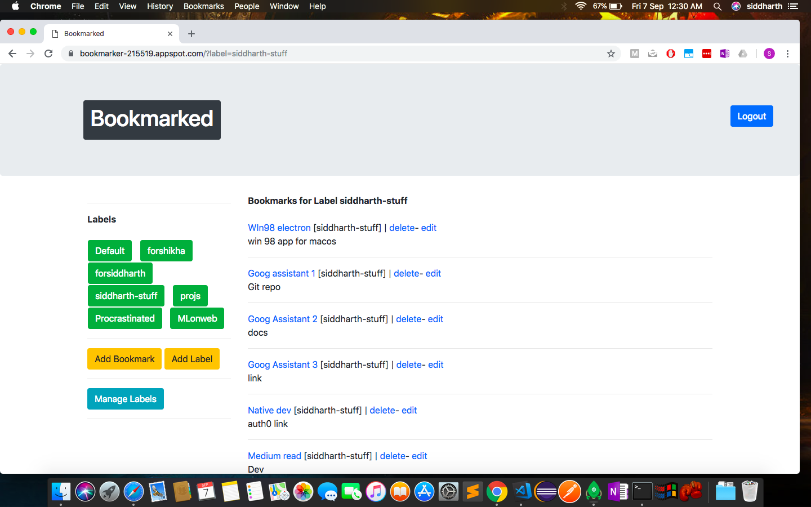
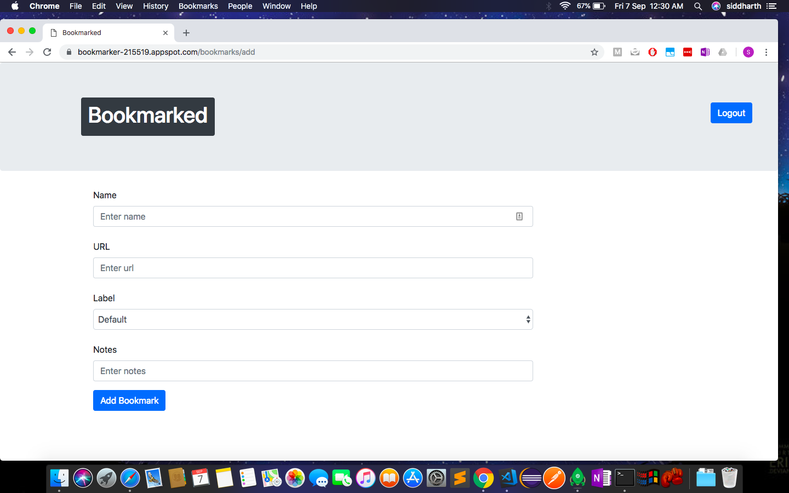
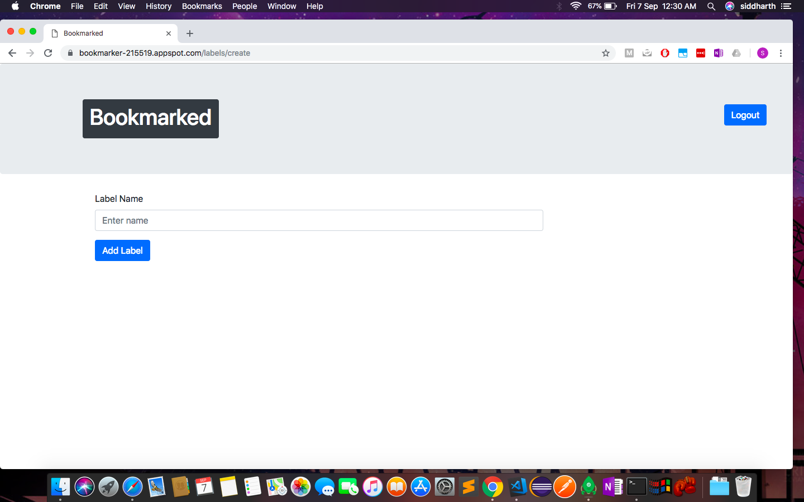
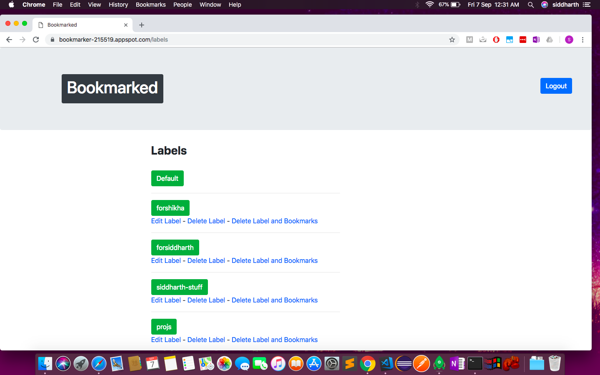

# bookmarked
A simple service to keep track of Bookmarks from a web interface.

Uses MongoDB as primary database, uses Redis to maintain 'session'. Has custom cookie and session management independent of django auth.
Has complete CRUD functionality for bookmarks and associated labels.

Screenshots:-

Main page with all bookmarks

Main page with bookmarks of a particular label

Add bookmark page

Add label page

Manage label page

